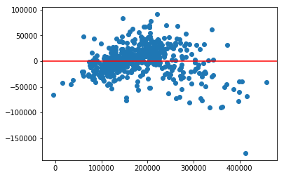
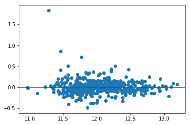
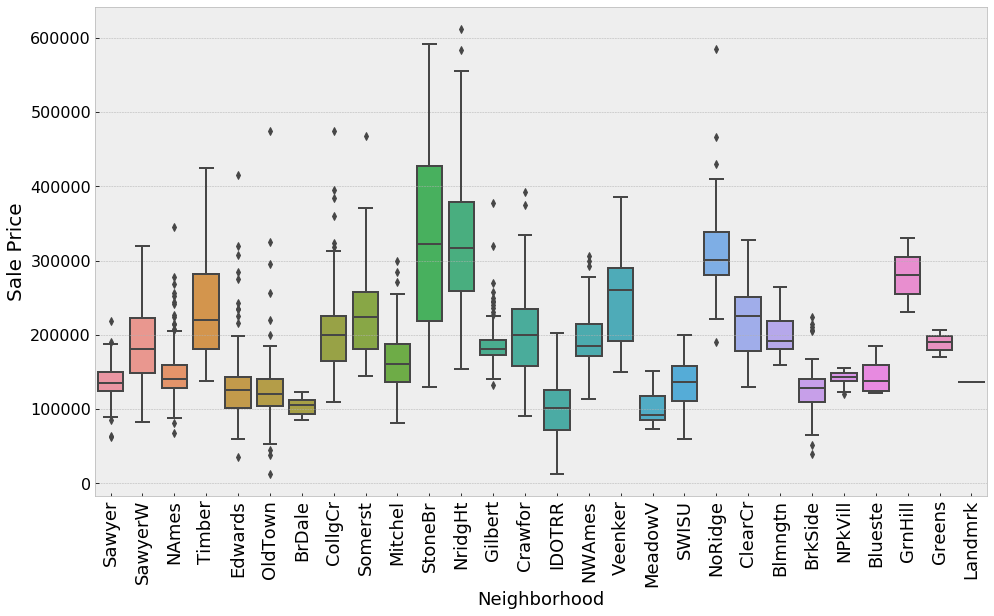

# Housing Prices in Iowa
_Author: J Hall_

## Table of Contents

## Contents

1. [Problem statement](#Problem-statement)
2. [Description of data](#Description-of-data)
3. [Model performance on training/ test data](#Model-performance-on-training-and-test-data)
4. [Primary findings/conclusions/recommendations](#Primary-findings,-conclusions,-recommendations)
5. [Next steps](#Next-steps)
6. [Presentation](./Housing_Prices_Presentation_for_Zillow.pdf)

### Problem statement
Zillow has become one of the top services to view real estate and price shop before buying.  The value that Zillow provides is information, and realistic expectations as to what is affordable, and where homebuyers should look for the best value.  Zillow is enjoying market dominance at the moment, but online audiences can be fickle, and sensitive when it comes to something as personal, emotional, and expensive as purchasing a home.  A streak of poor estimates and bad reviews could be enough to turn online audiences to Redfin or Trulia.

Zillow purchased 1,535 houses and sold 786 in the second quarter, representing sequential growth of 71% and 90%, respectively. From this activity, Zillow generated 249 million Dollars in Q2 revenue in its "homes" segment.
    
I aim to create a model that will accurately predict home prices with an 95% accuracy, which will not only provide a valuable service to our users, but will also indicate undervalued properties that would indicate good investments for Zillow. 
### Description of data
* The dataset had 81 features and 2930 rows.
- This was split up into a training set of 2051 rows, and a testing set of 879 rows.
- Data was downloaded from Kaggle as part of a competition initially posted by Zillow.  The data was originally compiled by the [Ames City Assessor](http://www.cityofames.org/assessor/ "Ames City Assessor").
- The target in this dataset was the Sale Price.  Because this is a continuous data set, linear regression models were used to predict price.
- A [Data Dictionary](../datasets/Data_Dictionary.md) can be found in the repository for reference.

### Model performance on training and test data
- I started with a baseline of just the most correlated feature, overall quality, in a linear regression model.  This gave me a baseline of:

| Model              | Features                     | Train score | Cross val score | Test score | R2     |
|--------------------|------------------------------|-------------|-----------------|------------|--------|
| Linear Regression  | [Overall_Qaulity](./code/02_Preprocessing_and_Feature_Engineering.ipynb#baseline) | 0.6412      | 0.6318          | 0.6577     |        |
| Linear Regression  | [features_Q](./code/02_Preprocessing_and_Feature_Engineering.ipynb#features_Q)    | 0.8386      | 0.8305          | 0.8643     |        |
| Linear Regression  | [features_2](./code/02_Preprocessing_and_Feature_Engineering.ipynb#features_2)    | 0.7847    | 0.7780          | 0.7941     |        |
| LassoCV            | [features_Q](./code/02_Preprocessing_and_Feature_Engineering.ipynb#lasso_Q)       | 0.8629      | 0.8571          | 0.8465     |        |
| LassoCV            | [features_4](./code/02_Preprocessing_and_Feature_Engineering.ipynb#lasso_4)       | 0.8495      | 0.8495          | 0.8349     |        |
| LassoCV            | [features_5](./code/02_Preprocessing_and_Feature_Engineering.ipynb#lasso_5)       | 0.8515      | 0.8480          | 0.8345     | 0.8777 |
| LassoCV            | [features_6](./code/02_Preprocessing_and_Feature_Engineering.ipynb#lasso_6)       | 0.8516      | 0.8483          | 0.8345     | 0.8782 |
| LassoCV            | [features_7](./code/02_Preprocessing_and_Feature_Engineering.ipynb#lasso_7)       | 0.9458      | 0.9174          | 0.9098     | 0.9435 |
| LassoCV            | [features_8](./code/02_Preprocessing_and_Feature_Engineering.ipynb#lasso_8)       | 0.9496      | 0.9218          | 0.9070     | 0.9434 |
| LassoCV, alpha=560 | [features_9](./code/02_Preprocessing_and_Feature_Engineering.ipynb#lasso_9)       | 0.9681      |  N/A               | 0.9411     |        |
| LassoCV            | [features_10](./code/02_Preprocessing_and_Feature_Engineering.ipynb#lasso_10)     | N/A            |  N/A               |            |        |
| LassoCV            | [features_11](./code/02_Preprocessing_and_Feature_Engineering.ipynb#lasso_11)     | N/A       |      N/A           |            |        |
| LassoCV, alpha=539  | [features_13](./code/02_Preprocessing_and_Feature_Engineering.ipynb#lasso_13)     |0.9597    |   N/A              | 0.8996           |        |

    
### Primary findings, conclusions, recommendations
#### According to this model, the 5 best features for higher price of a home are:

- Ground Living Area
- Overall Quality
- Year Built
- Overall Condition
- Total Basement Square Feet

This tells us that the best thing a homeowner can do to increase the value of their house is add on to their house, increasing their square footage. Year of remodel or addition also had an large impact on the price, coming in at the 8th on the list of positive features.

The neighborhood with the highest priced houses was Northridge Heights, followed closely by Crawford, Stone Brook, and Northridge Heights.

#### The top 5 features that have a negative impact on price are:

- Home functionality - salvage only
- Ms_zoning - Commercial
- Kitchen quality - good
- Gravity heating
- Kitchen quality - Typical / Average

This tells us that houses with average and good kitchens are seen as less valuable than houses that have newly rennovated kitchens. Many homebuyers see ronvating a kitchen as a way to improve the resale value of their house, so this makes sense that a full kitchen renovation for a poor quality kitchen that could actually be found appealing to home buyers over an average kitchen that may only need an upgrade.

While gravity furnaces can work nearly forever and have very few mechanical problems, they are incredibly expensive to operate and take up a lot of space. Due to the sheer volume of ducts needed to distribute air throughout your home and the cost of heating enough air to ensure it rises properly, you’re dealing with a heating efficiency of 50% or lower.*

Living in a commercial zone is unapealing in Ames, most likely because there are plenty of neighborhoods farther from commercial zones and assumed polution as well as restrictions on what you can do with your home.**

https://www.carneyphc.com/blog/heating/what-is-a-gravity-furnace/ * https://www.cityofames.org/home/showdocument?id=662
### Next steps
- I feel confident that this model would work well in other towns to a certain extent given a similar dataset. Some elements that would not be taken into account by this model are urban communities that have different values for homebuyers.

A datapoint that would improve the model would be school districts an quality metrics related to them. Some of that information is baked into the neighborhood metric given in this dataset, but it would be helpful to see the effect that schools have independent from neighborhoods

This model and solution is very well suited for home pricing, but could also be very useful in predicting other continuous variables, like scores in a game, and other pricing scenarios in which there are dozens of features, such as with cars or boats.  The model would need to be tweeked an reworked in such a scenario, but I believe the methodology would hold up in many large price-tag datasets.

1. [Exploratory Data Analysis](#Exploratory-Data-Analysis)
    - [Target Variable Distribution](#Target-Variable-Distribution)
    - [Residual Distribution](#Linear-Regression-Residual-Distribution)
    - [Neighborhood and Price](#Neighborhood-and-Price)
    - [Features and Sale Price Heatmap](#Features-and-Sale-Price-Heatmap)
    - [Numeric Feature Scatter](#Numeric-Feature-Scatter)
    
2. [Data Cleaning](#Data-Cleaning)

### Exploratory Data Analysis

#### Target Variable Distribution

#### Target Variable Distribution after Power Transformation

#### Linear Regression Residual Distribution

#### Linear Regression REsidual Distrubution after Power Transformation

#### Neighborhood and Price

#### Features and Sale Price Heatmap

#### Numeric Feature Scatter

Features with correlation over 0.65 are in Red

### Data Cleaning

- The Data came with 2051 rows and 81 features in the training dataset.
- There were some outliers with Sqare footage over 4,000 that were priced below market, they were removed after it was determined that they were not representative of the dataset
- There were some typos, such as the garage build year as 2207 that were remedied
- Column names were changed to snake case
- Null values were filled with zeros for numeric columns
- Null values for categorical data were removed when those columns were one-hot encoded
- In both cases the null values appear to be accurate depictions of non-applicable data
- Highly correlated features were combined into interaction terms
- Clean datasets were saved as CSV files to be used in subsequent notebooks.

[_Credit to: Tim Dwyer_](https://git.generalassemb.ly/DSI-US-9/style_guide)
